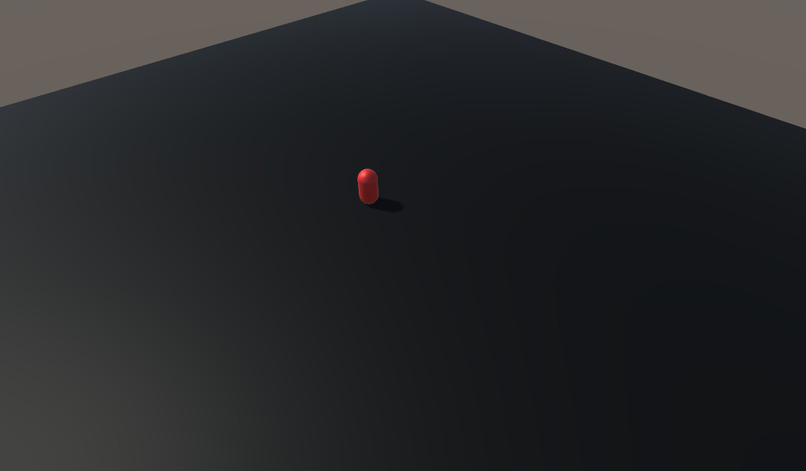

# Basic Movement

In this example a object is moved from one position to another using a script.

## Environment Configuration
- Microsoft Visual Studio Community 2019 16.5.3
- Unity 2018.4.21f1 Personal

## Game Views

